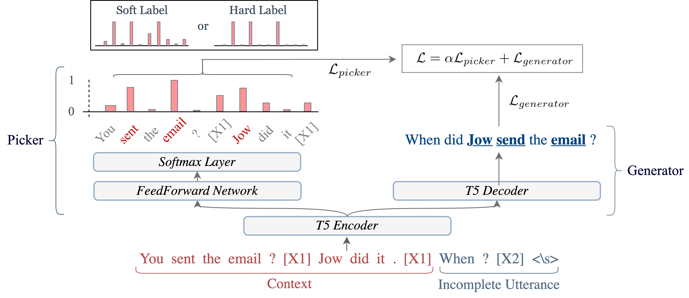

# Enhance Incomplete Utterance Restoration by Joint Learning Token Extraction and Text Generation
<a href="https://www.python.org/"></a>
<a href="https://pytorch.org/get-started/locally/"></a>
<a href="https://pytorchlightning.ai/"></a>
<a href="https://hydra.cc/"></a>


This is the repository for implementation of paper [Enhance Incomplete Utterance Restoration by Joint Learning Token Extraction and Text Generation](https://arxiv.org/abs/2204.03958 "Paper Link").

<br>



This paper introduces a model for incomplete utterance restoration (IUR). Different from prior studies that only work on extraction or abstraction datasets, we design a simple but effective model, working for both scenarios of IUR. Our design simulates the nature of IUR, where omitted tokens from the context contribute to restoration. From this, we construct a Picker that identifies the omitted tokens. To support the picker, we design two label creation methods (soft and hard labels), which can work in cases of no annotation of the omitted tokens. The restoration is done by using a Generator with the help of the Picker on joint learning. Promising results on four benchmark datasets in extraction and abstraction scenarios show that our model is better than the pretrained T5 and non-generative language model methods in both rich and limited training data settings.

## Setup
### Datasets


### Environment
```
conda env create -f environment.yml
conda activate jointiur
```
## Usage
### Training
```
python train.py
```
### Evaluation
```
python test.py
```

## Citation
If you would like to cite our paper in your work, this is the current reference:
```
@ARTICLE{Inoue2022-tb,
  title         = "Enhance Incomplete Utterance Restoration by Joint Learning
                   Token Extraction and Text Generation",
  author        = "Inoue, Shumpei and Liu, Tsungwei and Son, Nguyen Hong and
                   Nguyen, Minh-Tien",
  month         =  apr,
  year          =  2022,
  archivePrefix = "arXiv",
  primaryClass  = "cs.CL",
  eprint        = "2204.03958"
}
```